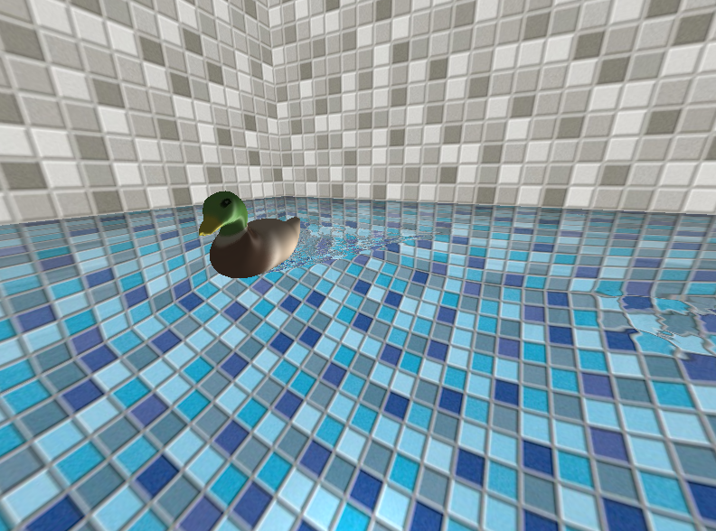

# duck-in-pool

Just a duck swimming in a pool. Duck path is defined using a random BSpline
path. Swimming duck causes water movement which causes reflection to move.

[Click here to see a video on YouTube.](https://www.youtube.com/watch?v=TuEqa6zj608)

It may be tricky to compile, but if you are really determined you'll need the
following libraries installed: `GLEW`, `GLFW`, `GLM`, `SOIL`.